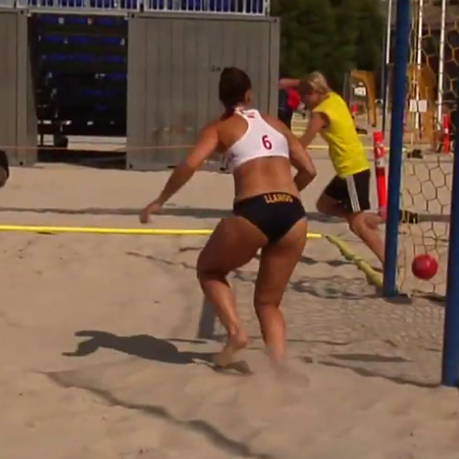
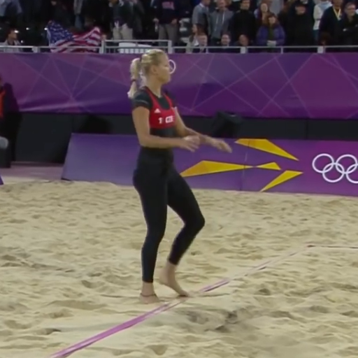
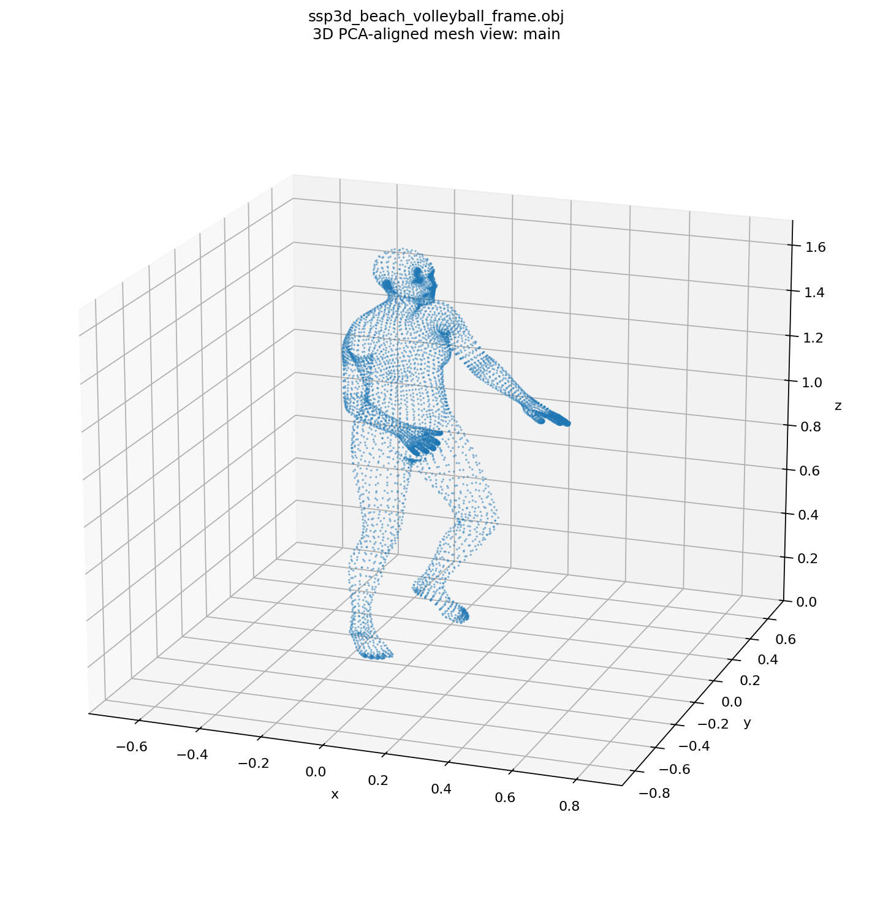
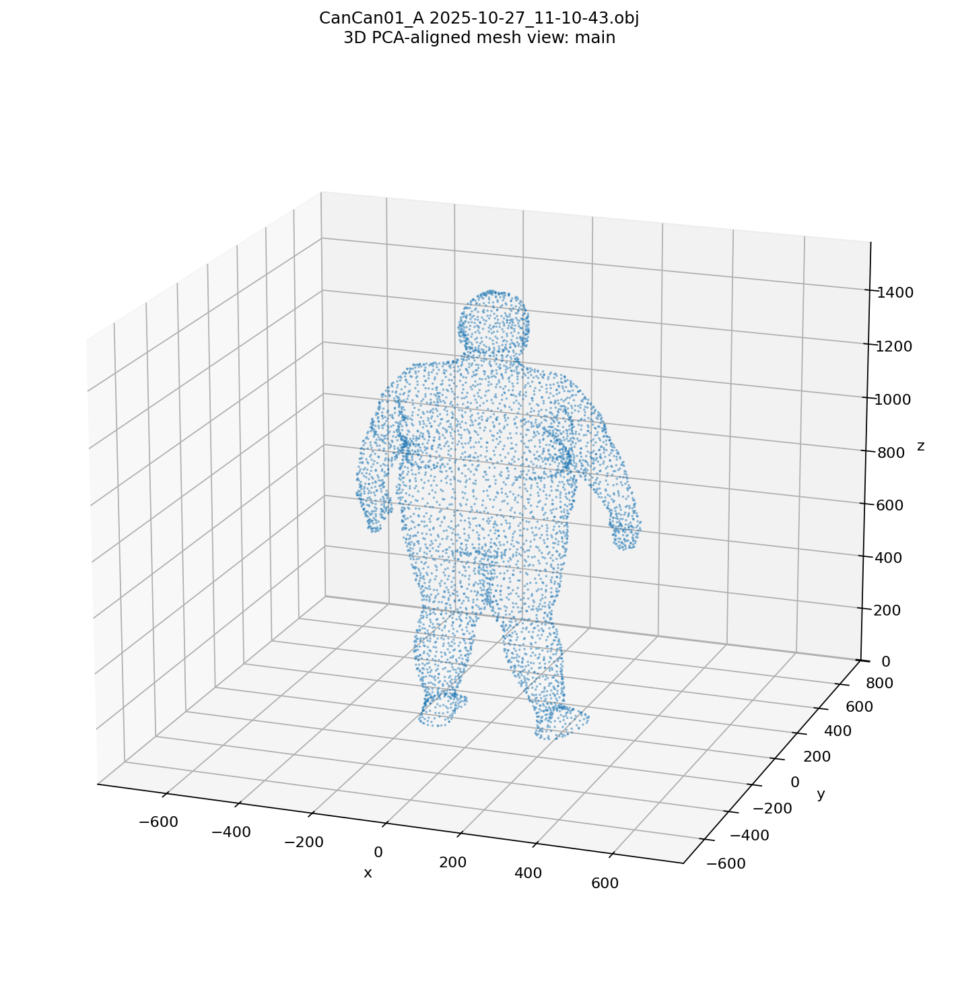

# Unified Pennington Tool

`unified` is the staged entry point for the relocated Pennington Python tools.
It keeps the scientific backends in place and closes the wrapper contract around
input classification, OBJ handoffs, run directories, and manifests.

```bash
python -m unified --input IMAGE_OR_OBJ_OR_DIR --image-method auto --anthro-method auto --units auto
```

Stage commands remain available:

```bash
python -m unified img2obj --input path/to/person.png --method auto
python -m unified obj2anthro --input path/to/person.obj --method auto --units auto
python -m unified.img2obj --input path/to/person.png --method auto
python -m unified.obj2anthro --input path/to/person.obj --method auto --units auto
```

The top-level pipeline infers the needed stages from `--input`: image files enter
`img2obj`, OBJ files enter `obj2anthro` directly, and mixed directories do both.
Direct OBJ handoffs use source method `direct`. Image `auto` resolves to the
CameraHMR route, exports concrete OBJ handoffs, and resolves top-level
anthropometry `auto` to the robust slice branch for CameraHMR meshes. Explicit
`--anthro-method all` remains available when both anthropometry backends are
desired.

## Artifacts

By default every generated artifact lands under root `runs/<run_id>/`, which is
untracked:

```text
runs/<run_id>/
    manifest.json
    img2obj/
        ...
    obj2anthro/
        <source_method>/
            <subject_id>/
                <anthro_method>/
                    results.csv
                    raw/
```

The root manifest records the run id, repository commit, timestamps, original
input, classified input plan, selected methods, stage statuses, warnings/errors,
image artifact roots, OBJ handoffs, and every anthropometry branch with CSV/raw
paths and row counts.

Status policy:

- `success`: every selected required stage and anthropometry branch succeeded.
- `partial`: at least one useful final branch succeeded, but some stage or branch
  failed or an image backend produced no OBJ handoff.
- `failed`: no useful final anthropometry output was produced.

The CLI exits `0` only for `success`; `partial` and `failed` are nonzero for
automation.

## Example Inputs

Two SSP-3D sports frames are included as lightweight documentation inputs:





Use them for local image-backend checks when CameraHMR/SMPL/image dependencies are
installed:

```bash
python -m unified --input unified/docs/assets/ssp3d_beach_volleyball_frame.png --image-method auto --anthro-method auto --units auto
```

Do not treat an image run as verified unless its `manifest.json` contains at
least one `obj_handoffs[*].obj_path` and a successful `obj2anthro` branch.

## Verified Wrapper Paths

The notebook at `docs/notebooks/image_to_anthro_pipeline.ipynb` demonstrates the
full staged wrapper with lightweight monkeypatched backends. It was executed with:

```text
C:\Users\Clint\AppData\Local\Programs\Python\Python312\python.exe
```

The real CameraHMR route was verified on the SSP-3D volleyball frame:

```bash
python -m unified --input unified/docs/assets/ssp3d_beach_volleyball_frame.png --image-method auto --anthro-method auto --units auto
```

That run produced a successful root manifest, one primary CameraHMR OBJ handoff,
one slice anthropometry CSV, and raw plot artifacts under `runs/<run_id>/`.



The existing OBJ path was also verified with the slice backend:

```bash
python -m unified --input "Python_slice_2026/OBJ/CanCan01_A 2025-10-27_11-10-43.obj" --anthro-method slice --units auto --out runs/verify_cancan01_a
```



That run recorded no image stage, one slice anthropometry row, and raw slice
artifacts under the run stage folder.

## Layout

| Stage | Path | Notes |
|---|---|---|
| Image to OBJ | `unified/img2obj/` | Relocated `Python_img_to_obj/`; native `src/pipeline/` is preserved. |
| OBJ to anthropometry | `unified/obj2anthro/` | Re-homed anthropometry wrapper and backend adapters. |
| Segmentation backend | `unified/obj2anthro/backends/segmentation/` | Relocated `Python_Fall2025/`. |
| Slice backend | `unified/obj2anthro/backends/slice/` | Thin wrapper; implementation remains at `Python_slice_2026/`. |
| ML experiments | `unified/ml/experiment/` | Relocated `Python_ML_2021/`; not redesigned as inference. |

## CameraHMR Root

CameraHMR remains an external checkout. Set `CAMERAHMR_ROOT` when it is not at the
default `~/CameraHMR`.

```bash
export CAMERAHMR_ROOT=~/CameraHMR
```

On PowerShell:

```powershell
$env:CAMERAHMR_ROOT = "~/CameraHMR"
```

See `RELOCATION_MAP.md` for old-to-new paths and tested command migrations.
